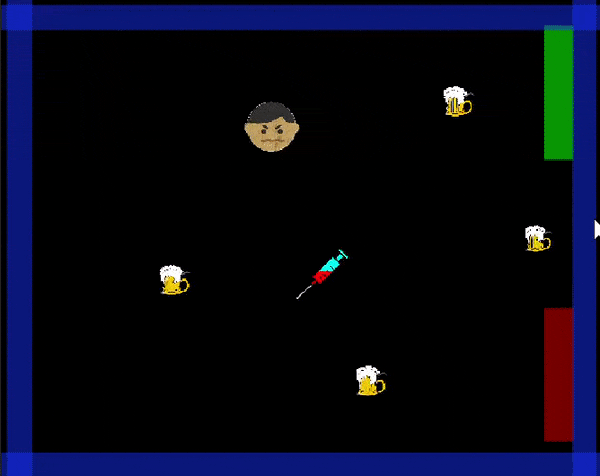

# 2D-Beer-Escape-Game
This game is part of my learning experience of Unity basics. 
This is a 2D game which involves basic unity functionalities
 1. User Input for 2D Movement
 2. Basic UI
 3. Basic Scene Managment

# Demo

